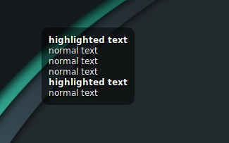

# simpleDesktopNotes

Display text from file on Cinnamon desktop.

## Features



* Choose file to load
* Set width
* Set background color and transparency
* Set text color
* Set border radius

To make text highlighted, add `#` at the beginning of line.

## Manual installation
```
cd /home/[YOUR USERNAME]/.local/share/cinnamon/desklets
mkdir simpleDesktopNotes@piotrek-k
cd simpleDesktopNotes@piotrek-k/
git clone https://github.com/piotrek-k/simpleDesktopNotes.git
```